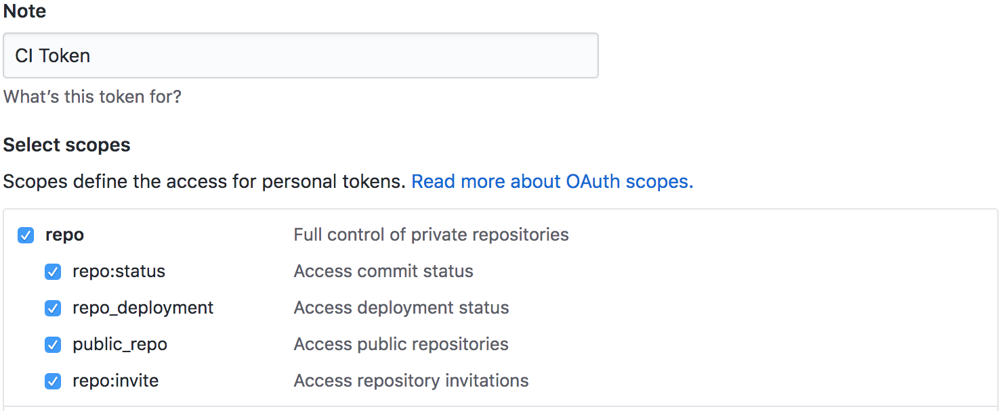
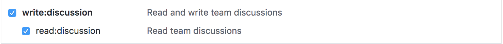
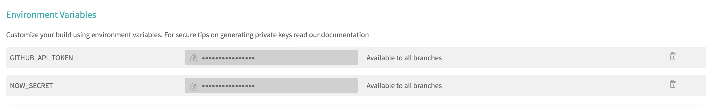

# ci-cd-showcase-api

https://master-branch-ci-cd-showcase-api-taogilaaa.now.sh/

A repository containing implementation of serverless technology + immutable deployments + continuous integration + continuous deployment, the goal is to showcase the benefits of these workflow

## Prerequisites

This project requires

- [nodejs](https://nodejs.org/en/)
- [yarn](https://yarnpkg.com/en/docs/install)

## Getting Started

### Installation

Use the package manager [yarn](https://yarnpkg.com/en/docs/install) to install dependencies.

```bash
yarn
```

### Example

Examples can be found on this project's [pull request](https://github.com/taogilaaa/ci-cd-showcase-api/pulls)

* [Create new sum resolver](https://github.com/taogilaaa/ci-cd-showcase-api/pull/2)

### Deployment

* Create a feature branch, and push the commits to this repo, the CI runner will run and detect changes, and deploy the artifacts to [zeit's now][now]

## Test it yourself

### Using this Repository

1. Create a new branch and push the commits here
2. [Optional] Create a new pull request!

### Using a Fork

1. Fork this repository
2. Create github [access token][github token] to allow [travis ci][travis] to access repo and write to discussions
  
  
3. Register and get your [now](https://zeit.co/download) secret key
4. Setup your repository settings on travis ci https://travis-ci.com/USER_NAME/REPO_NAME/settings and add `GITHUB_API_TOKEN` and `NOW_SECRET`
  
5. Make a commit and push it !

[travis]: https://travis-ci.com/
[now]: https://zeit.co/
[github token]: https://github.com/settings/tokens
